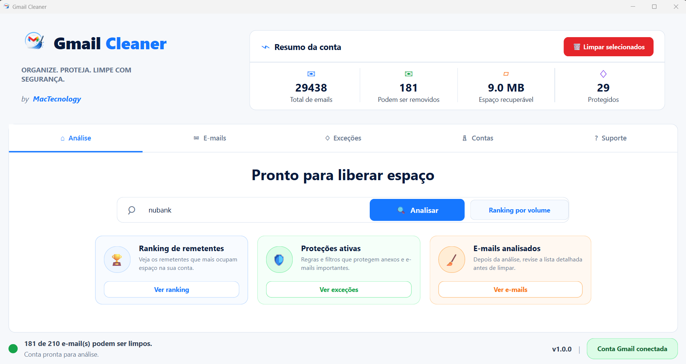
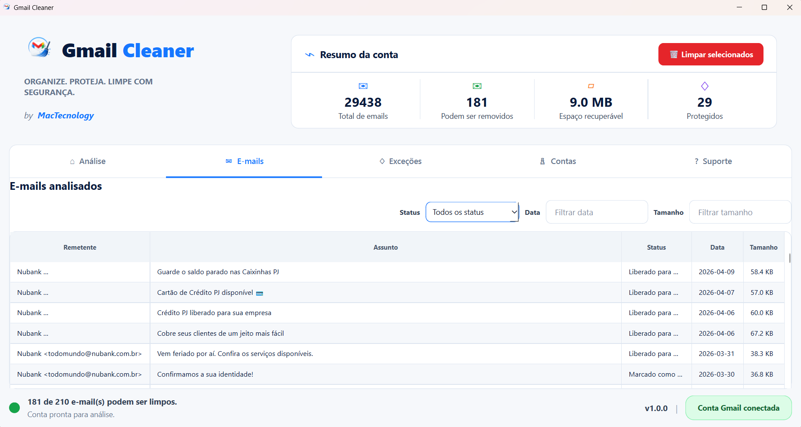
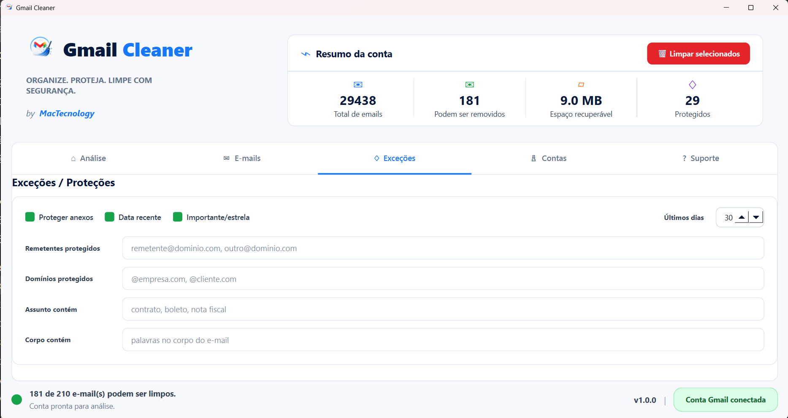

# Gmail Cleaner

Gmail Cleaner é um aplicativo desktop em Python/PyQt6 para ajudar a encontrar remetentes que ocupam muito espaço no Gmail e mover e-mails selecionados para a lixeira com regras de proteção.

O foco do projeto é limpeza com controle: antes de mover qualquer mensagem, o app analisa anexos, e-mails recentes, marcadores de importância/estrela e exceções configuradas pelo usuário.

## Screenshots

### Dashboard



### E-mails analisados



### Exceções e proteções



## Funcionalidades

- Login com OAuth 2.0 usando a conta Google.
- Busca manual por remetente ou domínio.
- Ranking de remetentes por volume de mensagens.
- Pré-visualização dos e-mails antes da limpeza.
- Proteção automática para e-mails com anexo.
- Proteção para e-mails recentes, importantes ou com estrela.
- Regras de exceção por remetente, domínio, assunto e corpo do e-mail.
- Movimentação para a lixeira, sem exclusão permanente.
- Histórico local das limpezas executadas.

## Tecnologias

- Python
- PyQt6
- Gmail API
- Google OAuth 2.0

## Requisitos

- Windows 10 ou superior.
- Python 3.11 ou superior recomendado.
- Conta Google com Gmail.
- Projeto no Google Cloud com Gmail API habilitada.
- OAuth Client ID do tipo **Desktop app**.

## Instalação

Clone o repositório:

```powershell
git clone https://github.com/MauricioApCastro/gmail_cleaner
cd gmail_cleaner
```

Crie a venv e instale as dependências:

```powershell
python -m venv .venv
.\.venv\Scripts\python.exe -m pip install -r requirements.txt
```

## Credenciais do Gmail

1. Acesse o Google Cloud Console.
2. Crie ou selecione um projeto.
3. Habilite a Gmail API.
4. Crie um OAuth Client ID do tipo **Desktop app**.
5. Baixe o arquivo JSON do cliente OAuth.
6. Salve o arquivo como:

```text
credentials\client_secret.json
```

Na primeira conexão, o navegador será aberto para login e autorização. Depois disso, o token local será salvo em:

```text
credentials\token.json
```

## Como Abrir

Pelo atalho do Windows:

```powershell
.\start_gmail_cleaner.bat
```

Ou diretamente pelo Python:

```powershell
.\.venv\Scripts\python.exe run.py
```

## Fluxo De Uso

1. Abra o aplicativo.
2. Clique em **Conectar Gmail**.
3. Busque um remetente manualmente ou gere o ranking por volume.
4. Revise a lista de e-mails analisados.
5. Ajuste as exceções, se necessário.
6. Confirme a limpeza para mover os e-mails liberados para a lixeira.

## Segurança

O Gmail Cleaner usa o fluxo oficial de autenticação do Google e solicita escopo de modificação do Gmail para conseguir mover mensagens para a lixeira.

O app não exclui e-mails permanentemente. As mensagens limpas são movidas para a lixeira do Gmail, onde ainda podem ser recuperadas antes da exclusão definitiva feita pelo próprio Gmail.

Não publique estes arquivos:

```text
credentials\client_secret.json
credentials\token.json
src\data\
```

Esses caminhos já estão protegidos pelo `.gitignore`.

## Estrutura Do Projeto

```text
.
├── run.py
├── requirements.txt
├── start_gmail_cleaner.bat
├── credentials\
└── src\
    ├── auth\
    ├── config\
    ├── controllers\
    ├── models\
    ├── services\
    ├── ui\
    └── assets\
```

## Autor

Mauricio Castro  
MacTecnology

## Licença

Projeto para estudo, portfólio e evolução contínua.
